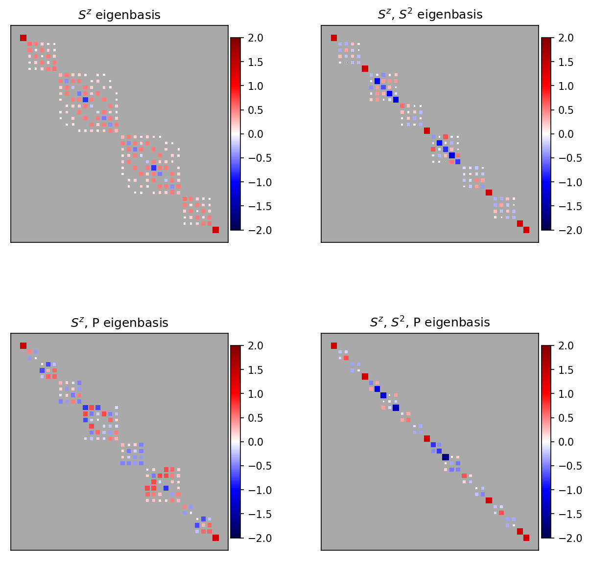

# matrix-partition

Automatically partition a matrix into a block diagonal form with respect to 
symmetries.



Installation
---------------

1. Update packaging softare
    ```
    python3 -m pip install --upgrade pip setuptools wheel
    ```

1. (Optional) Create a 
[virtual environment](https://packaging.python.org/en/latest/tutorials/installing-packages/#creating-virtual-environments).

1. Clone source
    ```
    git clone https://github.com/thenoursehorse/matrix-partition
    ```

1. Install from local
    ```
    cd matrix-partition
    python3 -m pip install --user ./
    ```

To uninstall

```
python3 -m pip uninstall matrix-partition
```

Dependencies
-------------

* numpy
* scipy
* (Optional) networkx, which makes the merge list sort faster, but sorting 
likely is not a bottleneck anyway.

Usage
-------------
```
from matrix_partition.autopartition import AutoPartition
model = AutoPartition(hamiltonian)
model.apply_symmetries(dictionary_of_symmetries)
model.set_labels()
model.print_labels()
model.plot()
```

Examples
---------------

* Ising chain into parity sectors. For parameters and info:
    ```
    python3 ising.py -h
    ```
* Time evolution unitary of a XXZ spin-1/2 chain into SU(2), and parity 
sectors. For parameters and info:
    ```
    python3 xxz.py -h
    ```

To do
---------------

1. The connections, sectors, and permutations need to be stored for each 
symmetry that is applied.
1. Implement function to rotate a state into the final permutation and basis 
after applying symmetry.
1. Change everything to use sparse matrices
1. Other useful types of plots.

References
---------------

1. The automatic partitioning is inspired from 
[TRIQS](https://triqs.github.io)
in the reference 
[P. Seth, I. Krivenko, M. Ferrero, and O. Parcollet, Comp. Phys. Comm. 200, 274–284 (2016)](http://dx.doi.org/10.1016/j.cpc.2015.10.023).

Code not under GPL-3.0
---------------

1. The algorithms to merge lists that share common elements are from:
<https://stackoverflow.com/a/4843408> by user Jochen Ritzel
and
<https://stackoverflow.com/a/4842897> by user Howard.

1. Hinton plot is copied from 
<https://matplotlib.org/stable/gallery/specialty_plots/hinton_demo.html>
and the [QuTip](https://qutip.org/) library.